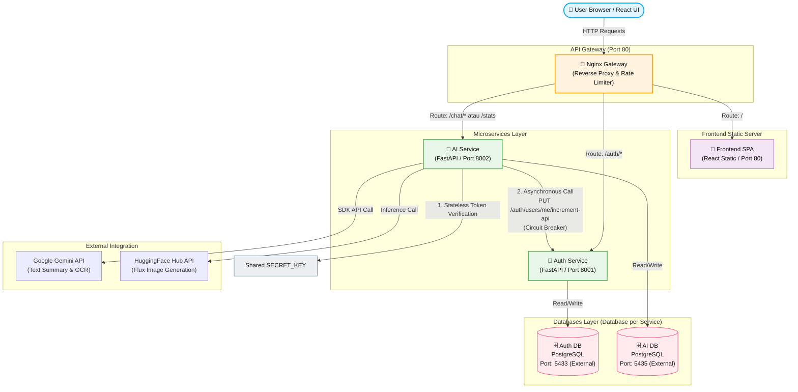

# 🎨 Inti Rupa — Cloud-Native GenAI Platform

[](https://github.com/aidilsaputrakirsan-classroom/cc-kelompok-a-steam/actions)
[](https://github.com/aidilsaputrakirsan-classroom/cc-kelompok-a-steam/releases)
[](#tech-stack)

**Inti Rupa** adalah aplikasi web asisten cerdas berbasis cloud yang membantu Anda meringkas teks dan menghasilkan gambar secara otomatis. Aplikasi ini memisahkan layanan autentikasi pengguna dan pemrosesan AI ke dalam sistem microservices agar kinerjanya lebih cepat dan stabil.

Melalui fitur **Summarizer & OCR**, pengguna dapat mengambil teks dari artikel web atau gambar dokumen lalu merangkum isinya dengan mudah. Selain itu, dengan fitur **Visual Generator**, pengguna bisa membuat gambar kreatif baru hanya dengan mengetikkan deskripsi teks sederhana.

---

## 🏗️ Architecture Design

Sistem **Inti Rupa** dirancang dengan arsitektur microservices terdesentralisasi yang terisolasi dan mandiri.



### Desain Arsitektur Sistem:
1.  **API Gateway (Nginx):** Berperan sebagai pintu masuk utama untuk mengarahkan lalu lintas data, mengatur CORS, dan membatasi jumlah request agar server terhindar dari beban berlebih.
2.  **Database Terpisah (Database per Service):** Layanan autentikasi pengguna (`auth-service`) dan pemrosesan AI (`ai-service`) menggunakan database PostgreSQL terisolasi masing-masing (`auth_db` dan `ai_db`) agar data lebih aman dan mandiri.
3.  **Autentikasi JWT Stateless:** Layanan AI dapat langsung memverifikasi token masuk secara mandiri menggunakan kunci rahasia bersama (Shared Secret Key) tanpa perlu bertanya ke layanan Auth setiap saat. Hal ini membuat proses loading menjadi jauh lebih cepat.
4.  **Ketahanan Layanan (Circuit Breaker):** Hubungan antar layanan dilindungi oleh mekanisme Circuit Breaker. Jika layanan autentikasi sedang tidak tersedia, layanan AI akan tetap berjalan melayani pengguna yang sudah login secara normal.

---

## 👥 Tim Pengembang (Kelompok Steam)

| Peran | Nama | NIM | Tanggung Jawab Utama |
| :--- | :--- | :--- | :--- |
| **Lead Backend** | Irfan Zaki Riyanto | 10231045 | REST API Desain, Database Per-Service, Skema Pydantic, & JWT Auth |
| **Lead Frontend** | Incha Raghil | 10231043 | SPA React UI, State Management, Integrasi API, & Dynamic UX |
| **Lead DevOps** | Jonathan Cristopher Jetro | 10231047 | CI/CD GitHub Actions, Docker Compose, Gateway Nginx, & Monitoring |
| **Lead QA & Docs** | Jonathan Joseph Y. T. | 10231048 | Automated API Testing, Reliability Skenario, & API Contract Specs |

---

## 🛠️ Tech Stack

*   **Frontend:** React (SPA), Vite, Vanilla CSS (Premium Custom Theme, Glassmorphism, Responsive Grid)
*   **Backend Framework:** FastAPI (Python 3.11/3.12, ASGI Asynchronous Engine)
*   **Database:** PostgreSQL 16 (Alpine-based Container)
*   **Gateway & Security:** Nginx (Reverse Proxy, Rate Limiter)
*   **AI Engine Integrations:**
    *   **Google Gemini 1.5 Flash:** OCR (Visual-to-Text) dan Text Summarization
    *   **HuggingFace Inference API (FLUX.1 Schnell):** Text-to-Image Generation
*   **Monitoring & Observability:** Structured JSON Logging, Custom Performance Metrics Endpoint (`/metrics`), Correlation ID Tracing, dan Real-time Health Dashboard.

---

## 🔐 Security Hardening & Rate Limiting

Untuk melindungi sistem dari penyalahgunaan dan serangan keamanan di lingkungan production:
*   **Strict Nginx Rate Limiting:**
    *   `auth_limit` (Endpoint Pendaftaran/Login): **5 request/detik** per IP address (mencegah brute force).
    *   `api_limit` (Endpoint AI Chat/Image Gen): **20 request/detik** per IP address.
    *   `general_limit` (Statik Frontend & Aset): **30 request/detik** per IP address.
*   **Strict Input Validation:** Schema `UserCreate` di `auth-service` diperkuat dengan validasi panjang password maksimal 128 karakter, sanitasi spasi nama lengkap, enkripsi kata sandi menggunakan `passlib` bcrypt, dan validasi format alamat email standar RFC.
*   **Secrets Isolation:** Kredensial sensitif diisolasi ke dalam `.env` dan tidak pernah masuk ke version control (diamankan melalui `.gitignore`). Template variabel pengembang didokumentasikan pada `.env.example`.

---

## 🚀 Panduan Memulai Cepat (Quick Start)

### Prasyarat System:
*   Docker & Docker Compose (v2.0+)
*   Git

### Langkah-langkah Menjalankan Sistem Secara Lokal:

1.  **Clone Repository:**
    ```bash
    git clone https://github.com/aidilsaputrakirsan-classroom/cc-kelompok-a-steam.git
    cd cc-kelompok-a-steam
    ```

2.  **Konfigurasi Environment:**
    Salin file template `.env.example` menjadi `.env`:
    ```bash
    cp .env.example .env
    ```
    Buka file `.env` baru dan masukkan API Key Anda untuk provider AI:
    ```env
    GEMINI_API_KEY=AIzaSy_masukkan_gemini_key_anda
    HUGGINGFACE_API_KEY=hf_masukkan_huggingface_key_anda
    SECRET_KEY=masukkan_32_karakter_acak_untuk_keamanan_jwt
    ```

3.  **Jalankan Microservices Container:**
    ```bash
    docker compose up -d --build
    ```

4.  **Verifikasi Status Kontainer:**
    Pastikan seluruh service berstatus `healthy`:
    ```bash
    docker compose ps
    ```

5.  **Akses Aplikasi:**
    *   **Frontend Client:** [http://localhost](http://localhost) (Port 80)
    *   **Real-time Health Dashboard:** [http://localhost/status](http://localhost/status)
    *   **Auth Service API Swagger Docs:** [http://localhost/auth/docs](http://localhost/auth/docs)
    *   **AI Service API Swagger Docs:** [http://localhost/chat/docs](http://localhost/chat/docs)

---

## 📈 Pemantauan Sistem (Observability)

Sistem ini dilengkapi pemantauan performa agar tim pengembang dapat melacak masalah dengan mudah:
*   **Correlation ID Tracing:** Setiap permintaan dari browser diberi ID unik. ID ini diteruskan ke semua layanan terkait sehingga tim pengembang bisa melacak jalannya proses jika terjadi kendala.
*   **Structured JSON Logging:** Catatan aktivitas server (logs) ditulis dalam format JSON standar agar mudah dibaca dan dianalisis secara terpusat.
*   **Metrik Layanan (Metrics):** Setiap layanan menyediakan data performa seperti jumlah request yang masuk, persentase error, dan waktu respon server (latency) melalui endpoint `/metrics`.

---

## 📝 Dokumentasi Teknis Tambahan

Seluruh dokumentasi detail dan laporan pengujian berkala proyek Inti Rupa dapat diakses pada tautan berikut:

1.  **[API Contract & Specifications](docs/api-contract.md)** — Kontrak payload & format endpoint backend.
2.  **[Operations & Troubleshooting Guide](docs/operations-guide.md)** — Buku panduan penanganan insiden dan pembacaan metrik.
3.  **[Reliability Testing Report](docs/reliability-testing.md)** — Laporan ketahanan sistem saat disimulasikan error/down.
4.  **[Deployment & Release Notes](docs/release-notes-m3.md)** — Catatan rilis v3.0.0 dan riwayat evolusi arsitektur.

---

## 🌐 Production Deployment (Railway)

Aplikasi kami telah di-deploy secara penuh di Railway Cloud dengan integrasi pipeline CI/CD otomatis pada branch `main`:
*   **Production Frontend Client:** [https://cc-kelompok-a-steam-production-51bf.up.railway.app](https://cc-kelompok-a-steam-production-51bf.up.railway.app)
*   **Production API Gateway:** [https://cc-kelompok-a-steam-production.up.railway.app](https://cc-kelompok-a-steam-production.up.railway.app)
