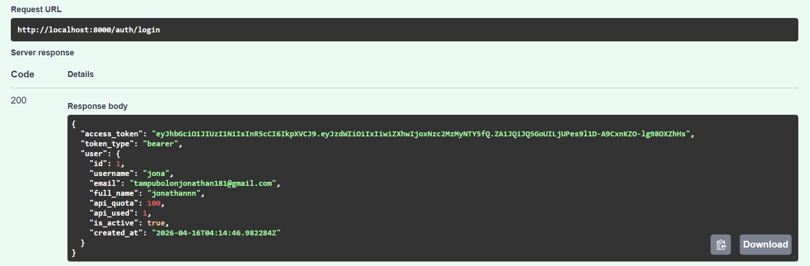

## Hasil Test API
### auth/login 

Gambar menunjukkan hasil dari proses login pengguna berupa:
- access_token: Token JWT yang digunakan untuk akses API secara aman.
- token_type: Jenis token yang digunakan adalah "bearer".
- user details: Detail pengguna dengan username "jona" dan email "tampubolonjonathan181@gmail.com".
- api_quota: Informasi kuota API yang dimiliki pengguna sebanyak 100.

### Generate/image

Gambar menunjukkan hasil dari permintaan pembuatan gambar (generate image) berupa:
- image_base64: Data gambar yang dihasilkan dalam format string Base64 yang sangat panjang (siap untuk dirender oleh aplikasi front-end).

### Authorize

- HTTPBearer: Status sistem yang sudah "Authorized", menunjukkan bahwa token akses telah berhasil dimasukkan untuk mengakses endpoint yang dilindungi.

### Gnerate/summarize

Gambar menunjukkan hasil dari fungsi peringkasan teks berupa:
- summary: Hasil ringkasan teks mengenai definisi komputasi awan (Cloud Computing).
- source: Teks asli yang digunakan sebagai sumber data untuk diringkas.
- model: Model AI yang digunakan untuk memproses data yaitu "gemini-2.5-flash".