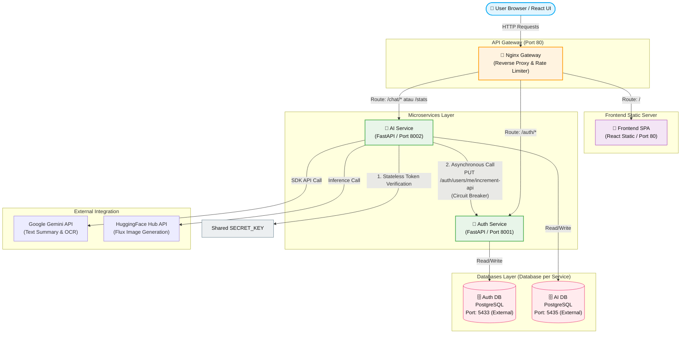

# 🏗️ Arsitektur Sistem & API Swagger — Inti Rupa Cloud App

Dokumen ini menjelaskan arsitektur microservices akhir dari platform **Inti Rupa** beserta panduan dokumentasi API interaktif menggunakan Swagger UI.

---

## 📊 Diagram Arsitektur Mikroservis

Sistem **Inti Rupa** menggunakan arsitektur microservices terdesentralisasi dengan 5 kontainer utama yang terhubung dalam satu jaringan internal Docker bridge (`intirupa`):

### Penjelasan Diagram:
1.  **Nginx API Gateway:** Bertindak sebagai entry point tunggal. Semua request dari browser diarahkan melalui port `80`. Nginx melakukan routing berdasarkan path prefix dan memproteksi endpoint dari brute-force melalui modul rate limiting.
2.  **Stateless JWT Verification:** Saat user mengakses endpoint terproteksi di `ai-service`, service ini tidak melakukan query/request verifikasi ke `auth-service`. Verifikasi token dilakukan secara stateless langsung di `ai-service` menggunakan kunci simetris `SECRET_KEY` yang sama (Shared Secret).
3.  **Circuit Breaker & Inter-service Communication:** Panggilan sinkron dari `ai-service` ke `auth-service` untuk pencatatan kuota API (`PUT /auth/users/me/increment-api`) dibungkus dengan Circuit Breaker. Jika `auth-service` mengalami downtime, sirkuit akan terbuka (OPEN state) dan request AI tetap dapat diproses (Graceful Degradation).

---

## 🔌 Pemetaan Port Layanan

| Nama Kontainer | Peran Kontainer | Port Internal | Port Eksternal | URL Akses |
| :--- | :--- | :--- | :--- | :--- |
| **intirupa-gateway** | Nginx Gateway | 80 | **80** | `http://localhost/` |
| **intirupa-frontend** | React Frontend SPA | 80 | - | Hanya via Gateway |
| **intirupa-auth-service** | FastAPI Auth Service | 8001 | - | `http://localhost/auth/` |
| **intirupa-ai-service** | FastAPI AI Service | 8002 | - | `http://localhost/chat/` |
| **intirupa-auth-db** | PostgreSQL Auth Database | 5432 | **5433** | `localhost:5433` |
| **intirupa-ai-db** | PostgreSQL AI Database | 5432 | **5435** | `localhost:5435` |

---

## 📖 API Documentation (Swagger)

FastAPI secara otomatis menghasilkan dokumentasi API interaktif yang mematuhi spesifikasi OpenAPI. Dokumentasi ini dapat digunakan untuk menguji fungsionalitas endpoint secara langsung dari browser.

### 1. Auth Service Swagger UI
Digunakan untuk interaksi & testing endpoint pendaftaran user, login, dan profile:
*   **URL Akses:** `http://localhost/auth/docs`
*   **Endpoint Utama:**
    *   `POST /auth/register` - Mendaftarkan akun baru.
    *   `POST /auth/login` - Autentikasi user & generate JWT Token.
    *   `GET /auth/users/me` - Mengambil detail profil user aktif.
    *   `PUT /auth/users/me/increment-api` - Increment counter kuota API user.
    *   `GET /auth/health` - Health check status service.

### 2. AI Service Swagger UI
Digunakan untuk interaksi & testing sesi AI Chat, OCR, Gambar, dan monitoring metrik:
*   **URL Akses:** `http://localhost/chat/docs`
*   **Endpoint Utama:**
    *   `POST /chat/sessions` - Membuat sesi interaksi AI baru.
    *   `GET /chat/sessions` - Mengambil daftar sesi interaksi user.
    *   `POST /chat/sessions/{session_id}/continue` - Mengirim prompt lanjutan dalam sesi.
    *   `PATCH /chat/sessions/{session_id}` - Mengupdate judul sesi AI.
    *   `DELETE /chat/sessions/{session_id}` - Menghapus sesi AI.
    *   `GET /stats` - Mengambil statistik detail penggunaan AI user login.
    *   `GET /stats/degraded` - Mengambil statistik global jika auth service down (mode degraded).
    *   `GET /stats/public` - Mengambil statistik publik agregat platform.
    *   `GET /health` - Health check AI service.
