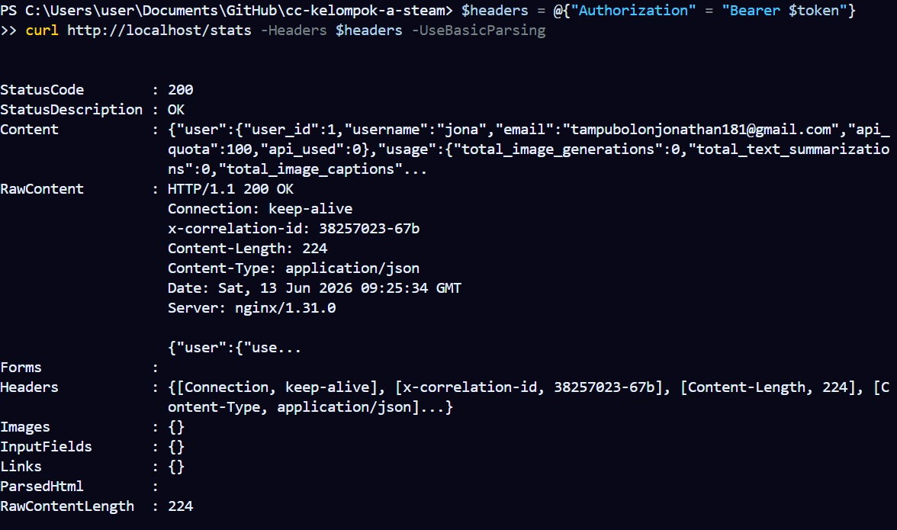
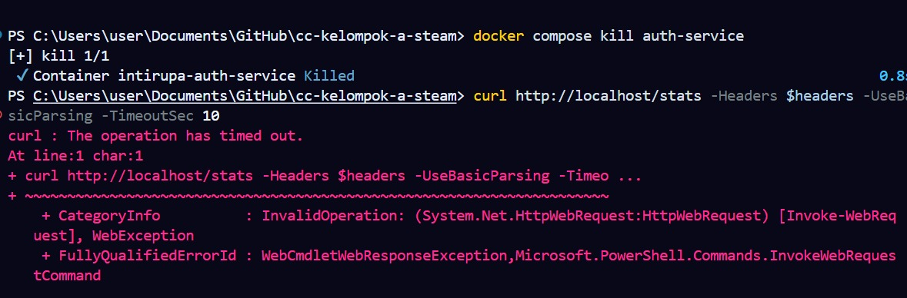
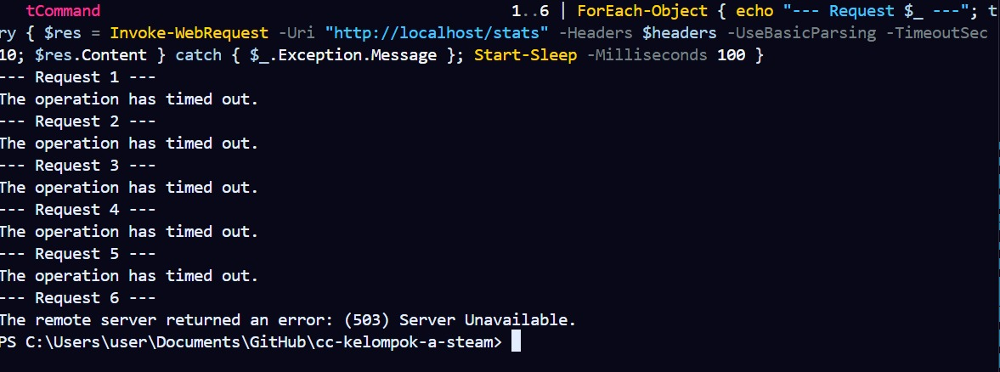
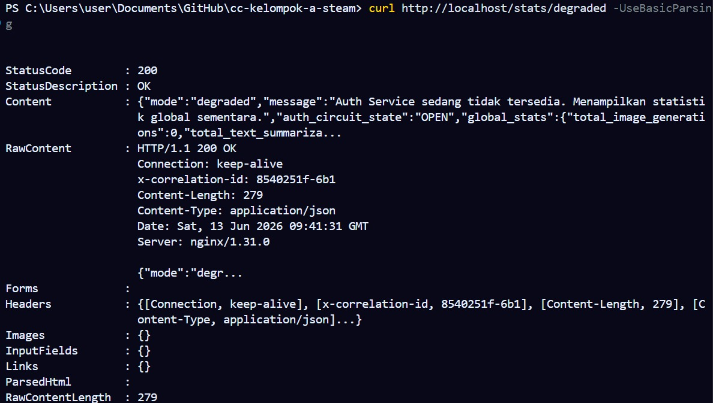
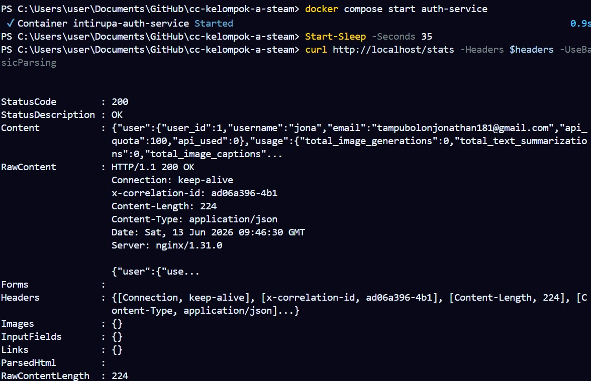
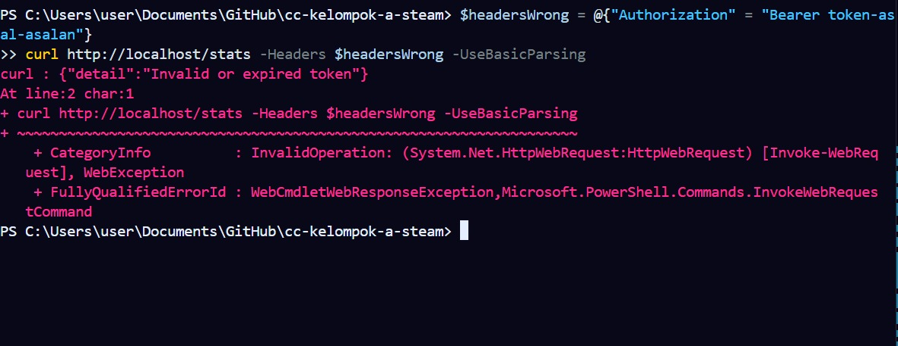
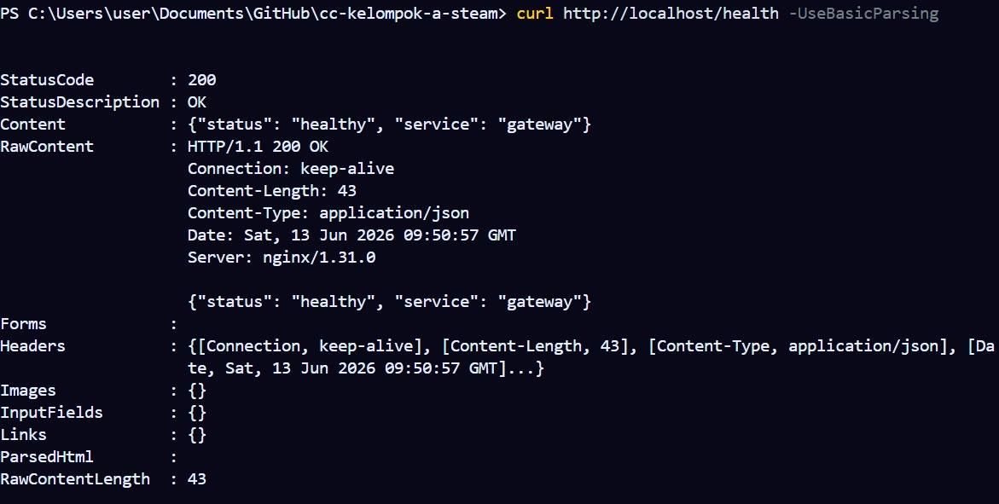

# Reliability Testing - Inti Rupa AI App

Dokumen ini adalah laporan dan panduan QA untuk Modul 13 pada aplikasi Inti Rupa. Fokus pengujian adalah memastikan komunikasi `ai-service` ke `auth-service` tetap aman, tangguh, dan terkendali saat terjadi service down, timeout, dan recovery.

## Tujuan

Reliability testing memastikan sistem memenuhi perilaku berikut:
- `ai-service` melakukan retry saat `auth-service` gagal merespons sementara.
- Retry berhenti setelah batas maksimal agar request pengguna tidak menggantung (*hang*) terlalu lama.
- Circuit breaker masuk ke state `OPEN` setelah batas threshold kegagalan beruntun terpenuhi.
- Saat circuit breaker `OPEN`, request gagal cepat (*Fast-Fail*) dengan status `503` tanpa membuang resource untuk memanggil `auth-service`.
- Saat `auth-service` kembali normal dan masa cooldown selesai, sistem dapat pulih kembali (*self-healing*).
- Endpoint `/health` pada `ai-service` menampilkan status `healthy` atau `degraded` secara akurat sesuai kondisi dependency.

## Komponen yang Diuji

| Komponen | File | Perilaku yang Diverifikasi |
|----------|------|----------------------------|
| Auth client | `services/ai-service/auth_client.py` | Retry, timeout, error handling, pemanggilan rute `/verify` |
| Circuit breaker | `services/ai-service/circuit_breaker.py` | State `CLOSED`, `OPEN`, `HALF_OPEN`, failure threshold, cooldown |
| AI health check | `services/ai-service/main.py` | Status dependency Auth Service di response `/health` teragregasi |
| Gateway | `services/gateway/nginx.conf` | Routing `/auth/*`, `/stats/*`, dan `/chat/*` dari port 80 ke kontainer yang benar |
| Docker Compose | `docker-compose.yml` | Resource limits, orkestrasi start, stop, dan healthcheck container |

## Ringkasan Pengumpulan Lead QA & Docs

| Kebutuhan Modul 13 | Bukti di Dokumen Ini | Status |
|--------------------|----------------------|--------|
| Skenario service down | RT-02, RT-03, RT-04, RT-07 | Sukses Diuji |
| Skenario timeout | RT-08 | Sukses Diuji |
| Skenario recovery | RT-05 | Sukses Diuji |
| Expected behavior | Tabel expected behavior pada setiap skenario | Lengkap |
| Cara reproduce | Command Docker dan curl/PowerShell pada setiap skenario | Lengkap (Disesuaikan untuk Windows) |
| Hasil test | Tabel hasil test pada setiap skenario | Diperbarui berdasarkan Hasil Aktual |
| Diagram arsitektur terbaru | `docs/architecture.md` bagian Reliability Layer Modul 13 | Sudah ditambahkan |

## Konfigurasi Reliability Saat Ini

| Setting | Nilai | Lokasi |
|---------|-------|--------|
| Auth Service URL | `http://auth-service:8001` | `AUTH_SERVICE_URL` di AI Service |
| Max retry | 3 attempt | `MAX_RETRIES` |
| Base delay | 0.5 detik | `BASE_DELAY` |
| Backoff delay | 0.5s, 1s, 2s | `BASE_DELAY * 2 ** (attempt - 1)` |
| Timeout per request | 5 detik | `TIMEOUT_SECONDS` |
| Retryable status | 500, 502, 503, 504 | `RETRYABLE_STATUS_CODES` |
| Circuit threshold | 5 failure | `failure_threshold` |
| Circuit cooldown | 30 detik | `cooldown_seconds` |

## Persiapan Test (PowerShell Windows)

Jalankan semua service dari root repository:
```powershell
docker compose up --build -d
```
Cek status container untuk memastikan seluruh sistem healthy:

```powershell
docker compose ps
```
Daftarkan akun dengan skema kolom yang sesuai (username dan full_name wajib disertakan):
```powershell
curl http://localhost/auth/register -Method POST -ContentType "application/json" -Body '{"email":"tampubolonjonathan181@gmail.com","password":"PasswordJona123!","username":"jona","full_name":"Jonathan"}' -UseBasicParsing
```
Jalankan login untuk mengambil dan mengunci token ke dalam variabel PowerShell:
```powershell
$loginReq = curl http://localhost/auth/login -Method POST -ContentType "application/json" -Body '{"email":"tampubolonjonathan181@gmail.com","password":"PasswordJona123!"}' -UseBasicParsing
$token = ($loginReq.Content | ConvertFrom-Json).access_token
```

### Skenario Test
* RT-01 Normal Flow: Auth Service Up
Tujuan: Memastikan baseline normal berjalan dengan baik sebelum failure test dilakukan.



* RT-02 Service Down: Auth Service Dihentikan
Tujuan: Memastikan ai-service tidak crash total saat auth-service mendadak tidak tersedia.



* RT-03 Circuit Breaker Opens Setelah Failure Threshold
Tujuan: Memastikan sakelar circuit breaker otomatis membuka (OPEN) setelah mendeteksi rentetan kegagalan beruntun yang melewati batas threshold.  



* RT-04 Fast Fail Saat Circuit Breaker OPEN
Tujuan: Memastikan aplikasi langsung mengembalikan respons mode darurat tanpa membuang resource jaringan ketika dependensi utama dipastikan sedang lumpuh.



* RT-05 Recovery Setelah Auth Service Kembali Up
Tujuan: Memastikan sistem dapat melakukan pemulihan mandiri (self-healing) setelah dependensi kembali aktif dan masa cooldown selesai.



* RT-06 Invalid Token Tidak Di-retry
Tujuan: Memastikan kegagalan yang bersifat deterministik (token palsu) tidak dihitung sebagai kegagalan sistem jaringan yang memicu sirkuit terbuka.



* RT-07 Health Check Degraded
Tujuan: Memastikan status agregasi kesehatan sistem mampu mendeteksi dan melaporkan jika ada komponen internal yang sedang terganggu.

 

